# Wordsmith

Wordsmith is an AI-powered plugin for Obsidian that enhances your note-taking experience with intelligent suggestions and advanced features.

## Project Structure

Here's a visual representation of our project structure:

```mermaid
graph TD
    A[main.ts] --> B[aiSuggestions.ts]
    A --> C[fileOperations.ts]
    A --> D[settings.ts]
    A --> E[settingsTab.ts]
    A --> F[speaker.ts]
    A --> G[tagSuggestionSidebar.ts]
    A --> H[tagSuggestionView.ts]
    A --> I[tagUtils.ts]
    A --> J[transcriptionService.ts]

    B --> B1[suggestTags]
    B --> B2[suggestNames]

    C --> C1[addTagToCurrentFile]
    C --> C2[removeTagFromCurrentFile]
    C --> C3[renameCurrentFile]

    D --> D1[PluginSettings]
    D --> D2[DEFAULT_SETTINGS]

    E --> E1[SettingsTab]

    F --> F1[SpeakerPopup]
    F --> F2[SpeakerIdentifier]

    G --> G1[TagSuggestionSidebar]

    H --> H1[TagSuggestionView]

    I --> I1[formatTag]
    I --> I2[getExistingTags]
    I --> I3[updateFrontMatter]

    J --> J1[transcribeAudio]
    J --> J2[transcribeWithDeepgram]
    J --> J3[saveTranscription]
    J --> J4[saveTranscriptionWithUniqueFilename]
```

## Features

- AI-powered tag suggestions
- Intelligent file name recommendations
- Audio transcription using Deepgram API
- Integration with OpenAI for content analysis
- Secure file storage using Oracle Cloud Infrastructure (OCI)
- Customizable settings for API keys and model parameters

## Installation

1. Download the latest release from the [GitHub repository](https://github.com/your-repo-link).
2. Extract the zip file into your Obsidian vault's plugins folder: `<vault>/.obsidian/plugins/`
3. Restart Obsidian and enable the Wordsmith plugin in the settings.

## Setup

1. Open the plugin settings in Obsidian.
2. Configure the following:
   - OpenAI API key
   - OpenAI base URL (optional, for custom endpoints)
   - OpenAI model selection
   - Temperature and max tokens settings
   - Deepgram API key for audio transcription
   - Transcription folder path
   - OCI bucket name and region
   - OCI config file path (default: `~/.oci/config`)

## Usage

- Use the ribbon icon or command "Suggest Tags and Names" to open the suggestion sidebar.
- Drag and drop audio files for automatic transcription.
- Click suggested tags to add or remove them from your note.
- Click suggested names to rename your current file.
- Use the refresh button to update suggestions.

## OCI Setup Instructions

To use OCI features:

1. Install OCI CLI:
   - macOS: `brew update && brew install oci-cli`
   - Other systems: `bash -c "$(curl -L https://raw.githubusercontent.com/oracle/oci-cli/master/scripts/install/install.sh)"`
2. Verify installation: `oci --version`
3. Set up OCI CLI configuration:
   - Run: `oci setup config`
   - Follow prompts to enter user OCID, tenancy OCID, region, and API key pair.
   - Verify config: `cat ~/.oci/config`

For detailed OCI setup, refer to the [Oracle Cloud documentation](https://docs.oracle.com/en-us/iaas/Content/API/SDKDocs/cliinstall.htm).

## Development

To set up the development environment:

1. Clone the repository.
2. Run `npm install` to install dependencies.
3. Use `npm run dev` to start compilation in watch mode.

## Contributing

Contributions are welcome! Please feel free to submit a Pull Request.

## License

This project is licensed under the MIT License.
